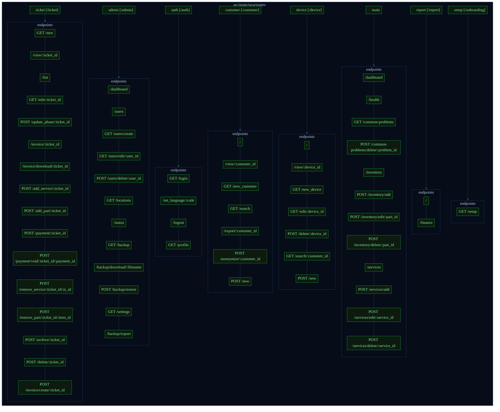

# Rendering Architecture

```mermaid
%%{init:{'theme':'base','themeVariables':{'background':'#060810','primaryColor':'#0c1a30','primaryTextColor':'#7dd3fc','primaryBorderColor':'#0e3a6e','edgeLabelBackground':'#0c1a30','lineColor':'#334155','secondaryColor':'#0f172a','clusterBkg':'#060c18','clusterBorder':'#1e3a5f','fontFamily':'JetBrains Mono','fontSize':'14'},'flowchart':{'nodeSpacing':25,'rankSpacing':8,'padding':4}}}%%
graph TD
  classDef ssr fill:#0d1a0d,stroke:#16a34a,color:#86efac
  classDef csr fill:#2d1200,stroke:#c2410c,color:#fb923c
  classDef ssg fill:#1a0d1a,stroke:#7c3aed,color:#c4b5fd
  classDef isr fill:#1a1a0d,stroke:#ca8a04,color:#fde047
  classDef ppr fill:#0d1a2d,stroke:#2563eb,color:#93c5fd
  classDef unk fill:#1a1a1a,stroke:#6b7280,color:#9ca3af
  classDef pkg fill:#0c1018,stroke:#475569,color:#cbd5e1
  classDef muted fill:#0a0d14,stroke:#374151,color:#64748b,stroke-dasharray: 3 3
  classDef hdr fill:#06080f,stroke:#1e3a5f,color:#7dd3fc
  subgraph HDR_PKG ["📁 src/main/java/routes"]
    direction TB
  leaf_admin["📄 admin [/admin]"]:::ssr
  subgraph endpoints_admin["endpoints"]
    direction TB
    route_routes_admin_py__admin_dashboard["/dashboard"]:::ssr
    route_routes_admin_py__admin_users["/users"]:::ssr
    route_routes_admin_py__admin_users_create["GET /users/create"]:::ssr
    route_routes_admin_py__admin_users_edit__user_id["GET /users/edit/:user_id"]:::ssr
    route_routes_admin_py__admin_users_delete__user_id["POST /users/delete/:user_id"]:::ssr
    route_routes_admin_py__admin_locations["GET /locations"]:::ssr
    route_routes_admin_py__admin_status["/status"]:::ssr
    route_routes_admin_py__admin_backup["GET /backup"]:::ssr
    route_routes_admin_py__admin_backup_download__filename["/backup/download/:filename"]:::ssr
    route_routes_admin_py__admin_backup_restore["POST /backup/restore"]:::ssr
    route_routes_admin_py__admin_settings["GET /settings"]:::ssr
    route_routes_admin_py__admin_backup_export["/backup/export"]:::ssr
    route_routes_admin_py__admin_dashboard --- route_routes_admin_py__admin_users
    route_routes_admin_py__admin_users --- route_routes_admin_py__admin_users_create
    route_routes_admin_py__admin_users_create --- route_routes_admin_py__admin_users_edit__user_id
    route_routes_admin_py__admin_users_edit__user_id --- route_routes_admin_py__admin_users_delete__user_id
    route_routes_admin_py__admin_users_delete__user_id --- route_routes_admin_py__admin_locations
    route_routes_admin_py__admin_locations --- route_routes_admin_py__admin_status
    route_routes_admin_py__admin_status --- route_routes_admin_py__admin_backup
    route_routes_admin_py__admin_backup --- route_routes_admin_py__admin_backup_download__filename
    route_routes_admin_py__admin_backup_download__filename --- route_routes_admin_py__admin_backup_restore
    route_routes_admin_py__admin_backup_restore --- route_routes_admin_py__admin_settings
    route_routes_admin_py__admin_settings --- route_routes_admin_py__admin_backup_export
  end
  leaf_admin --> endpoints_admin
  leaf_auth["📄 auth [/auth]"]:::ssr
  subgraph endpoints_auth["endpoints"]
    direction TB
    route_routes_auth_py__auth_login["GET /login"]:::ssr
    route_routes_auth_py__auth_set_language__code["/set_language/:code"]:::ssr
    route_routes_auth_py__auth_logout["/logout"]:::ssr
    route_routes_auth_py__auth_profile["GET /profile"]:::ssr
    route_routes_auth_py__auth_login --- route_routes_auth_py__auth_set_language__code
    route_routes_auth_py__auth_set_language__code --- route_routes_auth_py__auth_logout
    route_routes_auth_py__auth_logout --- route_routes_auth_py__auth_profile
  end
  leaf_auth --> endpoints_auth
  leaf_customer["📄 customer [/customer]"]:::ssr
  subgraph endpoints_customer["endpoints"]
    direction TB
    route_routes_customer_py__customer["/"]:::ssr
    route_routes_customer_py__customer_view__customer_id["/view/:customer_id"]:::ssr
    route_routes_customer_py__customer_new_customer["GET /new_customer"]:::ssr
    route_routes_customer_py__customer_search["GET /search"]:::ssr
    route_routes_customer_py__customer_export__customer_id["/export/:customer_id"]:::ssr
    route_routes_customer_py__customer_anonymize__customer_id["POST /anonymize/:customer_id"]:::ssr
    route_routes_customer_py__customer_new["POST /new"]:::ssr
    route_routes_customer_py__customer --- route_routes_customer_py__customer_view__customer_id
    route_routes_customer_py__customer_view__customer_id --- route_routes_customer_py__customer_new_customer
    route_routes_customer_py__customer_new_customer --- route_routes_customer_py__customer_search
    route_routes_customer_py__customer_search --- route_routes_customer_py__customer_export__customer_id
    route_routes_customer_py__customer_export__customer_id --- route_routes_customer_py__customer_anonymize__customer_id
    route_routes_customer_py__customer_anonymize__customer_id --- route_routes_customer_py__customer_new
  end
  leaf_customer --> endpoints_customer
  leaf_device["📄 device [/device]"]:::ssr
  subgraph endpoints_device["endpoints"]
    direction TB
    route_routes_device_py__device["/"]:::ssr
    route_routes_device_py__device_view__device_id["/view/:device_id"]:::ssr
    route_routes_device_py__device_new_device["GET /new_device"]:::ssr
    route_routes_device_py__device_edit__device_id["GET /edit/:device_id"]:::ssr
    route_routes_device_py__device_delete__device_id["POST /delete/:device_id"]:::ssr
    route_routes_device_py__device_search__customer_id["GET /search/:customer_id"]:::ssr
    route_routes_device_py__device_new["POST /new"]:::ssr
    route_routes_device_py__device --- route_routes_device_py__device_view__device_id
    route_routes_device_py__device_view__device_id --- route_routes_device_py__device_new_device
    route_routes_device_py__device_new_device --- route_routes_device_py__device_edit__device_id
    route_routes_device_py__device_edit__device_id --- route_routes_device_py__device_delete__device_id
    route_routes_device_py__device_delete__device_id --- route_routes_device_py__device_search__customer_id
    route_routes_device_py__device_search__customer_id --- route_routes_device_py__device_new
  end
  leaf_device --> endpoints_device
  leaf_main["📄 main"]:::ssr
  subgraph endpoints_main["endpoints"]
    direction TB
    route_routes_main_py__dashboard["/dashboard"]:::ssr
    route_routes_main_py__health["/health"]:::ssr
    route_routes_main_py__common_problems["GET /common-problems"]:::ssr
    route_routes_main_py__common_problems_delete__problem_id["POST /common-problems/delete/:problem_id"]:::ssr
    route_routes_main_py__inventory["/inventory"]:::ssr
    route_routes_main_py__inventory_add["POST /inventory/add"]:::ssr
    route_routes_main_py__inventory_edit__part_id["POST /inventory/edit/:part_id"]:::ssr
    route_routes_main_py__inventory_delete__part_id["POST /inventory/delete/:part_id"]:::ssr
    route_routes_main_py__services["/services"]:::ssr
    route_routes_main_py__services_add["POST /services/add"]:::ssr
    route_routes_main_py__services_edit__service_id["POST /services/edit/:service_id"]:::ssr
    route_routes_main_py__services_delete__service_id["POST /services/delete/:service_id"]:::ssr
    route_routes_main_py__dashboard --- route_routes_main_py__health
    route_routes_main_py__health --- route_routes_main_py__common_problems
    route_routes_main_py__common_problems --- route_routes_main_py__common_problems_delete__problem_id
    route_routes_main_py__common_problems_delete__problem_id --- route_routes_main_py__inventory
    route_routes_main_py__inventory --- route_routes_main_py__inventory_add
    route_routes_main_py__inventory_add --- route_routes_main_py__inventory_edit__part_id
    route_routes_main_py__inventory_edit__part_id --- route_routes_main_py__inventory_delete__part_id
    route_routes_main_py__inventory_delete__part_id --- route_routes_main_py__services
    route_routes_main_py__services --- route_routes_main_py__services_add
    route_routes_main_py__services_add --- route_routes_main_py__services_edit__service_id
    route_routes_main_py__services_edit__service_id --- route_routes_main_py__services_delete__service_id
  end
  leaf_main --> endpoints_main
  leaf_report["📄 report [/report]"]:::ssr
  subgraph endpoints_report["endpoints"]
    direction TB
    route_routes_report_py__report["/"]:::ssr
    route_routes_report_py__report_finance["/finance"]:::ssr
    route_routes_report_py__report --- route_routes_report_py__report_finance
  end
  leaf_report --> endpoints_report
  leaf_setup["📄 setup [/onboarding]"]:::ssr
  subgraph endpoints_setup["endpoints"]
    direction TB
    route_routes_setup_py__onboarding_setup["GET /setup"]:::ssr
  end
  leaf_setup --> endpoints_setup
  leaf_ticket["📄 ticket [/ticket]"]:::ssr
  subgraph endpoints_ticket["endpoints"]
    direction TB
    route_routes_ticket_py__ticket_new["GET /new"]:::ssr
    route_routes_ticket_py__ticket_view__ticket_id["/view/:ticket_id"]:::ssr
    route_routes_ticket_py__ticket_list["/list"]:::ssr
    route_routes_ticket_py__ticket_edit__ticket_id["GET /edit/:ticket_id"]:::ssr
    route_routes_ticket_py__ticket_update_phase__ticket_id["POST /update_phase/:ticket_id"]:::ssr
    route_routes_ticket_py__ticket_invoice__ticket_id["/invoice/:ticket_id"]:::ssr
    route_routes_ticket_py__ticket_invoice_download__ticket_id["/invoice/download/:ticket_id"]:::ssr
    route_routes_ticket_py__ticket_add_service__ticket_id["POST /add_service/:ticket_id"]:::ssr
    route_routes_ticket_py__ticket_add_part__ticket_id["POST /add_part/:ticket_id"]:::ssr
    route_routes_ticket_py__ticket_payment__ticket_id["POST /payment/:ticket_id"]:::ssr
    route_routes_ticket_py__ticket_payment_void__ticket_id__payment_id["POST /payment/void/:ticket_id/:payment_id"]:::ssr
    route_routes_ticket_py__ticket_remove_service__ticket_id__ts_id["POST /remove_service/:ticket_id/:ts_id"]:::ssr
    route_routes_ticket_py__ticket_remove_part__ticket_id__item_id["POST /remove_part/:ticket_id/:item_id"]:::ssr
    route_routes_ticket_py__ticket_archive__ticket_id["POST /archive/:ticket_id"]:::ssr
    route_routes_ticket_py__ticket_delete__ticket_id["POST /delete/:ticket_id"]:::ssr
    route_routes_ticket_py__ticket_invoice_create__ticket_id["POST /invoice/create/:ticket_id"]:::ssr
    route_routes_ticket_py__ticket_new --- route_routes_ticket_py__ticket_view__ticket_id
    route_routes_ticket_py__ticket_view__ticket_id --- route_routes_ticket_py__ticket_list
    route_routes_ticket_py__ticket_list --- route_routes_ticket_py__ticket_edit__ticket_id
    route_routes_ticket_py__ticket_edit__ticket_id --- route_routes_ticket_py__ticket_update_phase__ticket_id
    route_routes_ticket_py__ticket_update_phase__ticket_id --- route_routes_ticket_py__ticket_invoice__ticket_id
    route_routes_ticket_py__ticket_invoice__ticket_id --- route_routes_ticket_py__ticket_invoice_download__ticket_id
    route_routes_ticket_py__ticket_invoice_download__ticket_id --- route_routes_ticket_py__ticket_add_service__ticket_id
    route_routes_ticket_py__ticket_add_service__ticket_id --- route_routes_ticket_py__ticket_add_part__ticket_id
    route_routes_ticket_py__ticket_add_part__ticket_id --- route_routes_ticket_py__ticket_payment__ticket_id
    route_routes_ticket_py__ticket_payment__ticket_id --- route_routes_ticket_py__ticket_payment_void__ticket_id__payment_id
    route_routes_ticket_py__ticket_payment_void__ticket_id__payment_id --- route_routes_ticket_py__ticket_remove_service__ticket_id__ts_id
    route_routes_ticket_py__ticket_remove_service__ticket_id__ts_id --- route_routes_ticket_py__ticket_remove_part__ticket_id__item_id
    route_routes_ticket_py__ticket_remove_part__ticket_id__item_id --- route_routes_ticket_py__ticket_archive__ticket_id
    route_routes_ticket_py__ticket_archive__ticket_id --- route_routes_ticket_py__ticket_delete__ticket_id
    route_routes_ticket_py__ticket_delete__ticket_id --- route_routes_ticket_py__ticket_invoice_create__ticket_id
  end
  leaf_ticket --> endpoints_ticket
  end
```
